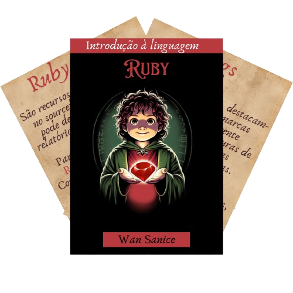

  

Bem-vindo ao projeto "Introdução à Linguagem Ruby"! Este é um recurso educacional dedicado a ajudar você a aprender e dominar a linguagem de programação Ruby, com uma pitada de inspiração da saga "Senhor dos Anéis".

## Sobre

Este projeto é uma iniciativa colaborativa para fornecer um guia abrangente sobre Ruby. Desde conceitos básicos até tópicos avançados, você encontrará exemplos práticos, explicações para iniciar sua jornada em Ruby.

## Recursos

- **Exemplos**: Explore uma variedade de exemplos de código para entender como Ruby funciona na prática.
- **Explicações**: Descubra explicações detalhadas sobre os conceitos fundamentais e avançados da linguagem Ruby.
- **Colaboração**: Contribua com feedback, sugestões e até mesmo novos conteúdos para melhorar a experiência de aprendizado de todos.

## Como Contribuir

- Sinta-se à vontade para abrir problemas (issues) relatando erros, sugerindo melhorias ou solicitando novos recursos.
- Faça pull requests com suas contribuições para ajudar a melhorar este recurso para a comunidade.

## Começando

Para começar a explorar Ruby conosco, siga estas etapas simples:
1. Clone este repositório em sua máquina local.
2. Navegue pelos diretórios e arquivos para encontrar os recursos que deseja estudar.
3. Leia as instruções em cada seção e experimente os exemplos de código.
4. Desafie-se com os exercícios propostos e verifique suas soluções.

## Agradecimentos

Este projeto é possível graças à contribuição de diversos membros da comunidade. Agradecemos a todos os colaboradores por tornarem este recurso cada vez mais útil e valioso para todos os aprendizes de Ruby.

Divirta-se explorando o mundo da programação Ruby e que a jornada seja tão emocionante quanto uma aventura épica em "Senhor dos Anéis"!

link do projeto no canva:
https://www.canva.com/design/DAGD1K1ULCI/mXBNXLvgx7tRktk1qUh1Nw/edit?utm_content=DAGD1K1ULCI&utm_campaign=designshare&utm_medium=link2&utm_source=sharebutton

**"Nagakburos"**
